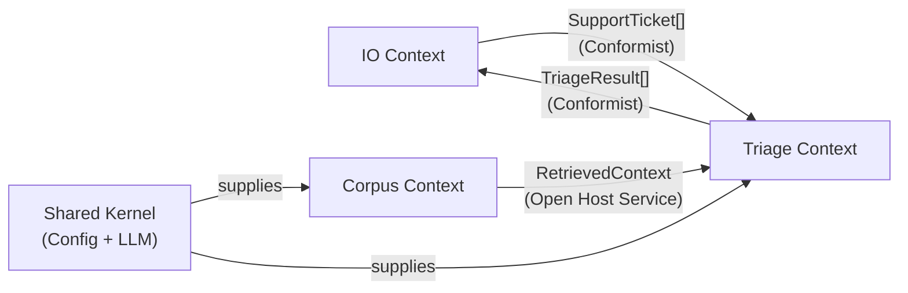
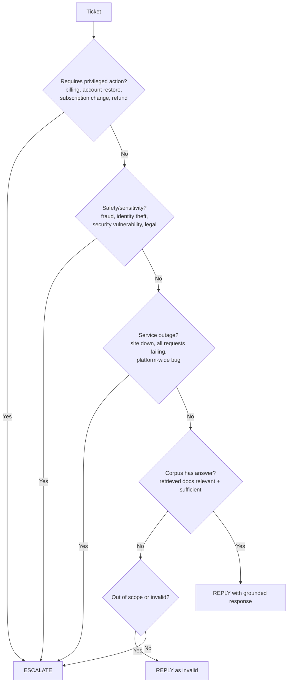
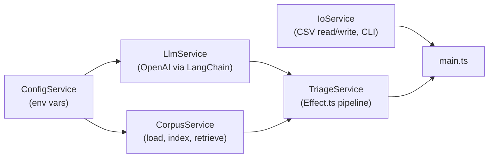

# Sprint 1 — Domain Design

## Ubiquitous Language

### Core Domain Terms

| Term | Definition | Example |
|------|-----------|---------|
| **Support Ticket** | A single inbound request from an end-user seeking help. Contains the user's issue description, an optional subject line, and an optional company label. This is the unit of work the agent processes. | "I lost access to my Claude team workspace..." |
| **Issue** | The main body text of a Support Ticket. May contain one or multiple requests, irrelevant noise, adversarial content, or sensitive data. | Free-form text field in CSV |
| **Subject** | An optional short label on a ticket. May be blank, partial, noisy, or misleading. Never trust as sole signal. | "Help needed", "", "Tarjeta bloqueada" |
| **Company** | The product ecosystem a ticket belongs to. One of: `HackerRank`, `Claude`, `Visa`, or `None`. When `None`, the agent must infer from issue content. | `HackerRank` |
| **Ecosystem** | Synonym for Company. The three supported ecosystems are HackerRank (hiring/assessment platform), Claude (Anthropic AI assistant), and Visa (payment network). | — |

### Triage Terms

| Term | Definition | Example |
|------|-----------|---------|
| **Triage** | The complete act of receiving a ticket, understanding it, deciding how to handle it, and producing a structured result. One triage produces exactly one TriageResult. | — |
| **Status** | The routing decision for a ticket. Either `replied` (agent answers directly) or `escalated` (forwarded to a human). Never both. | `replied` |
| **Escalation** | The decision to forward a ticket to a human agent because it is high-risk, sensitive, ambiguous, unsupported by the corpus, or requires privileged action (billing, account changes, security). | Billing disputes, security vulnerabilities, site outages |
| **Request Type** | Classification of the user's intent. One of: `product_issue` (how-to, configuration, access), `feature_request` (user wants something new), `bug` (something is broken), `invalid` (out-of-scope, irrelevant, adversarial). | `product_issue` |
| **Product Area** | The canonical internal label for the most relevant support category. Input may use different names; the LLM maps freely; the system normalises to a fixed enum per ecosystem (see Product Area Enum). Output prefers the internal canonical value. | `screen`, `community`, `privacy`, `travel_support` |
| **Response** | A user-facing answer grounded entirely in the support corpus. Must not contain hallucinated policies, fabricated steps, or unsupported claims. Must cite source document(s). | Step-by-step instructions from a corpus doc |
| **Source** | The corpus document path(s) that ground a Response. Attached as metadata on TriageResult for traceability. Enables future AI Judge verification logic. | `data/hackerrank/screen/invite-candidates/...md` |
| **Justification** | A concise internal explanation of why the agent chose a particular status, request type, and response. Must reference source document(s). | "Escalated: billing dispute, no corpus doc covers refund processing." |
| **Grounding** | The constraint that every claim in a Response must be supported by retrieved corpus documents. Ungrounded claims = hallucination = failure. | — |
| **Safety Gate** | Detection of adversarial, irrelevant, or out-of-scope tickets. Part of Phase 1 Analyze (single LLM call after retrieval). These get `replied` + `invalid`, not escalated. | "Iron Man actor" -> invalid, prompt injection -> invalid |
| **Company Inference** | When company=None, the agent infers the ecosystem from issue content. Part of Phase 1 Analyze. Retrieval always searches full corpus (no company filtering). | "it's not working" with no company -> full corpus search |

### Corpus Terms

| Term | Definition | Example |
|------|-----------|---------|
| **Corpus** | The complete set of support documentation shipped in `data/`. This is the sole source of truth. The agent must not use outside knowledge. | 774 markdown files across 3 ecosystems |
| **Corpus Document** | A single markdown file from the corpus. Tagged with its owning company and category (derived from file path). | `data/hackerrank/screen/getting-started/ai-assisted-tests.md` |
| **Category** | A subcategory within an ecosystem, derived from the directory path of a corpus document. Maps to Product Area. | `screen`, `interviews`, `claude-code`, `travel-support` |
| **Retrieved Context** | The top-K most relevant corpus documents returned by vector similarity search for a given ticket. This is what the agent reads before responding. | Top-5 documents matching "lost access to workspace" |
| **Retrieval** | The act of searching the corpus index to find relevant documents for a given ticket. Uses vector similarity (embeddings). | — |
| **Index** | The in-memory vector store built from all corpus documents at startup. Enables fast similarity search. | MemoryVectorStore with 774 embedded docs |

### DDD Building Block Classification

| Building Block | Instances | Notes |
|----------------|-----------|-------|
| **Aggregate Root** | `SupportTicket` | The unit of work. One ticket in, one result out. Triage Context owns the lifecycle. |
| **Value Object** | `SupportTicket`, `TriageResult`, `CorpusDocument`, `RetrievedContext` | All immutable. Identity is structural (fields), not by ID. |
| **Domain Service** | `TriageService` | Stateless orchestration: takes a ticket + corpus, produces a result. |
| **Infrastructure Service** | `CorpusService`, `LlmService`, `CsvReader`, `CsvWriter` | Adapters to external concerns (filesystem, LLM API, vector store). |
| **Domain Event** | None in MVP | No async side-effects needed. Could add `TicketTriaged` event later. |
| **Repository** | None in MVP | No persistence. Corpus is read-only from filesystem. |

### Context Map

- **IO -> Triage**: IO conforms to Triage's `SupportTicket` shape (Conformist)
- **Corpus -> Triage**: Corpus exposes a query API, Triage consumes it (Open Host Service)
- **Triage -> IO**: IO conforms to Triage's `TriageResult` shape for CSV output (Conformist)
- **Shared Kernel**: Config and LLM are shared infrastructure both Corpus and Triage depend on

---

## Bounded Contexts

```mermaid
block-beta
  columns 3
  block:Corpus["Corpus Context"]:1
    CorpusDocument
    CorpusIndex
    DocumentRetriever
  end
  block:Triage["Triage Context"]:1
    SupportTicket
    TriageResult
    AnalysisSchema
    Pipeline
    Analyzer
    Responder
  end
  block:IO["IO Context"]:1
    CsvReader
    CsvWriter
    CliArgs
    Validator
  end
```

## Value Objects (owned by their bounded context)

### Corpus Context

| Name | Fields | Notes |
|------|--------|-------|
| `CorpusDocument` | `content`, `source`, `company`, `category` | One markdown file from `data/` |
| `RetrievedContext` | `documents[]`, `query` | Top-K docs returned by vector search |

### Triage Context

| Name | Fields | Notes |
|------|--------|-------|
| `SupportTicket` | `issue`, `subject`, `company` | Immutable, parsed from CSV row |
| `TriageResult` | `status`, `product_area`, `response`, `justification`, `request_type`, `sources` | Output per ticket. `sources` is metadata (corpus doc paths) for traceability. |

### Shared Kernel

| Name | Fields | Notes |
|------|--------|-------|
| `ConfigService` | `openaiApiKey`, `dataDir` | Env vars via Effect Config, shared by all contexts |
| `LlmService` | `chatModel` | OpenAI ChatOpenAI (gpt-4o) wrapper, used by Triage |

## Product Area Enum (canonical internal values)

Input labels from users/LLM may vary. The system maps to these canonical values.
LLM chooses freely from this list. Empty string is valid for invalid/escalated tickets.

### HackerRank
`screen`, `interviews`, `library`, `community`, `integrations`, `settings`, `general_help`, `chakra`, `engage`, `skillup`

### Claude
`claude`, `claude_api_and_console`, `claude_code`, `claude_desktop`, `claude_for_education`, `claude_for_government`, `claude_mobile_apps`, `connectors`, `identity_management`, `privacy`, `pro_and_max_plans`, `safeguards`, `team_and_enterprise_plans`, `amazon_bedrock`

### Visa
`consumer`, `travel_support`, `small_business`, `general_support`

### Cross-domain / None
`general` (fallback when no ecosystem matched)

## Escalation Taxonomy

### Escalation categories (high-risk)
1. **Billing/Financial** — refunds, payments, subscription changes, charge disputes
2. **Account/Access** — restore access, admin actions, seat management
3. **Security** — vulnerabilities, compromised keys, identity theft, fraud
4. **Outages** — platform down, all requests failing, widespread bugs
5. **Compliance/Legal** — infosec forms, data requests, legal processes
6. **Insufficient info** — "it's not working" with no details AND no company

### NOT escalation (reply as invalid)
- Out-of-scope questions ("Iron Man actor")
- Adversarial / prompt injection attempts
- Thank-you / no-op messages
- Requests the agent has no ecosystem for

## Domain Rules

- `status` is either `replied` or `escalated` — never both
- `request_type` is one of: `product_issue`, `feature_request`, `bug`, `invalid`
- If the ticket is adversarial, irrelevant, or out-of-scope -> `replied` + `invalid` (detected in Phase 1 Analyze)
- If the ticket requires privileged action, involves safety/sensitivity, or is an outage -> `escalated` (decided in Phase 1 Analyze)
- If corpus has a grounded answer -> `replied` with source citation (Phase 2 Respond generates response)
- If corpus has no answer and ticket is not invalid -> `escalated`
- `product_area` must be a value from the Product Area Enum above, or empty for invalid/escalated-without-area tickets
- `sources` metadata tracks which corpus docs grounded the response (for future AI Judge logic)

## Service Boundaries (Effect Layers)

