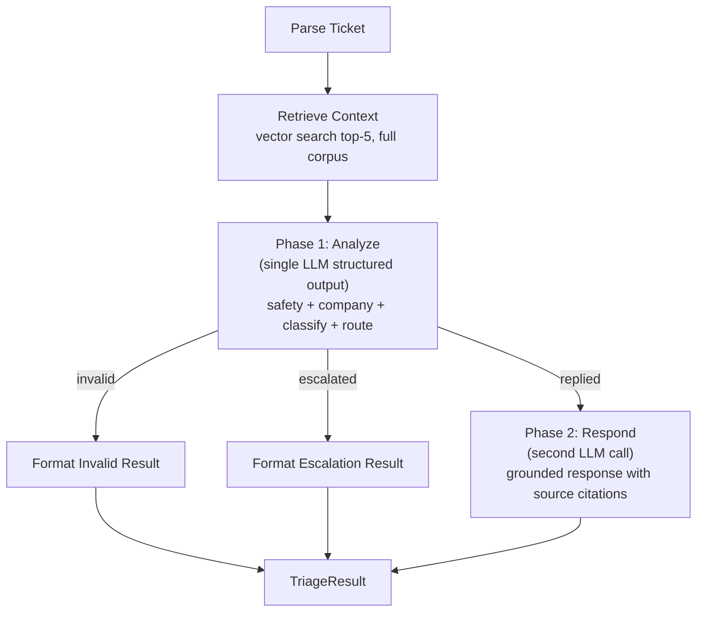
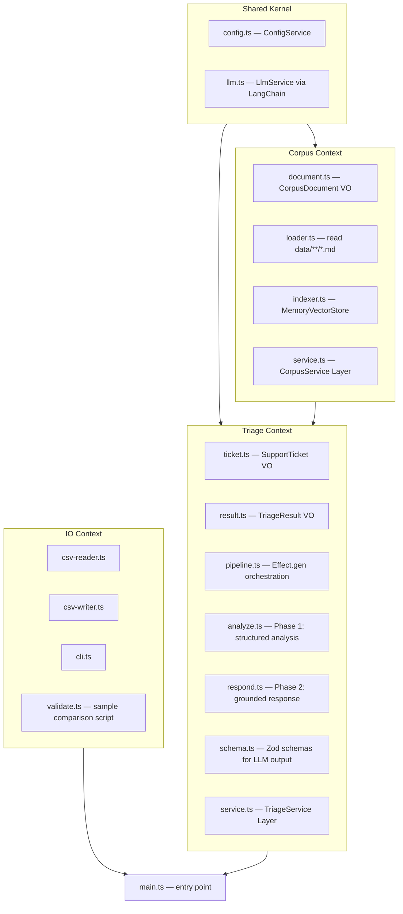

# Sprint 1 — Tech Design

## Stack

| Concern | Choice | Why |
|---------|--------|-----|
| Language | TypeScript (strict) | Preference |
| Runtime | Node.js via tsx | Fast dev, no build step needed |
| FP framework | Effect.ts | Pipe, Effect.gen, Layer, Service pattern |
| LLM client | @langchain/openai (`ChatOpenAI`, gpt-4o) | OpenAI API via LangChain abstraction |
| Vector store | LangChain MemoryVectorStore | Zero external deps, in-memory |
| Embeddings | @langchain/openai (`text-embedding-3-small`) | OpenAI embeddings for vector search. Cheap ($0.02/1M tokens). |
| Schema/validation | Zod | Structured output from LLM + domain VO validation |
| CSV | csv-parse + csv-stringify | Minimal, well-tested |
| CLI | process.argv + tsx shebang | Binary `hr` command, no compile step |
| Package manager | pnpm | Preference |
| Module system | ESM (`"type": "module"`) | LangChain v0.3+ requires ESM |

**Rejected:** LangGraph — evaluated but dropped. Our flow is a linear pipeline with one conditional branch. LangGraph is designed for cyclic agent loops, tool-use cycles, and human-in-the-loop. Effect.ts handles our pipeline natively with full type safety. LangChain is retained for LLM abstraction and RAG.

## Two-Phase LLM Pipeline (Effect.ts)



### Phase 1 — Analyze (1 LLM call per ticket, always)

Single `withStructuredOutput(AnalysisSchema)` call. Given ticket + retrieved context, returns:

```typescript
const AnalysisSchema = z.object({
  is_valid: z.boolean(),          // safety gate: false = adversarial/out-of-scope
  company: z.string(),            // inferred if input was None
  request_type: z.enum(["product_issue", "feature_request", "bug", "invalid"]),
  product_area: z.string(),       // canonical enum value
  status: z.enum(["replied", "escalated"]),
  escalation_reason: z.string().optional(),  // if escalated
  justification: z.string(),
  relevant_sources: z.array(z.string()),     // corpus doc paths used
})
```

### Phase 2 — Respond (1 LLM call, only if status=replied)

Given ticket + context + analysis, generates grounded response citing sources. Skipped for escalated/invalid tickets.

### Result: 1-2 LLM calls per ticket (down from 3-4)
- 30 tickets x ~1.5 avg calls = ~45 calls
- Runtime: ~2-3 min total

## Project Structure



```
code/
  package.json                  # "type": "module", ESM
  tsconfig.json
  bin/
    hr.js                       # #!/usr/bin/env tsx — thin shebang wrapper
  src/
    main.ts                     # Entry point, wires all layers, runs program
    shared/                     # Shared Kernel
      config.ts                 # ConfigService (OPENAI_API_KEY, DATA_DIR)
      llm.ts                    # LlmService (ChatOpenAI via LangChain)
    corpus/                     # Corpus Bounded Context
      document.ts               # CorpusDocument value object
      loader.ts                 # Recursively read data/**/*.md, tag company/category
      indexer.ts                # Build MemoryVectorStore from loaded docs
      service.ts                # CorpusService Effect Layer
    triage/                     # Triage Bounded Context
      ticket.ts                 # SupportTicket value object
      result.ts                 # TriageResult value object (includes sources metadata)
      schema.ts                 # Zod schemas: AnalysisSchema, ResponseSchema
      analyze.ts                # Phase 1: single LLM call -> structured analysis
      respond.ts                # Phase 2: grounded response with source citations
      pipeline.ts               # Effect.gen pipeline: retrieve -> analyze -> respond|skip
      service.ts                # TriageService Effect Layer (wraps pipeline + error recovery)
    io/                         # IO Bounded Context
      csv-reader.ts             # Parse input CSV -> SupportTicket[]
      csv-writer.ts             # TriageResult[] -> output.csv
      cli.ts                    # CLI args, binary `hr` command
      validate.ts               # Compare agent output vs sample expected output
```

## Effect.ts Architecture Pattern

### Service + Layer pattern

```typescript
// Each module exposes a Service + Layer
class CorpusService extends Context.Tag("CorpusService")<CorpusService, {
  readonly retrieve: (query: string) => Effect.Effect<RetrievedContext, CorpusError>
}>() {}

// Layers compose at main.ts
const MainLive = CorpusServiceLive.pipe(
  Layer.provideMerge(LlmServiceLive),
  Layer.provideMerge(ConfigServiceLive),
)
```

### Per-ticket pipeline with error recovery

```typescript
const triageTicket = (ticket: SupportTicket) => Effect.gen(function* () {
  const context = yield* CorpusService.retrieve(ticket.issue)
  const analysis = yield* analyzeTicket(ticket, context)   // Phase 1: structured output
  if (analysis.status !== "replied") {
    return TriageResult.fromAnalysis(ticket, analysis)
  }
  const response = yield* generateResponse(ticket, context, analysis)  // Phase 2
  return TriageResult.fromResponse(ticket, analysis, response)
})

// Main program with error recovery per ticket
const program = Effect.gen(function* () {
  const tickets = yield* readCsv(inputPath)
  const results = yield* Effect.forEach(tickets, (ticket) =>
    triageTicket(ticket).pipe(
      Effect.catchAll((error) => Effect.succeed(TriageResult.fromError(ticket, error)))
    ),
    { concurrency: 1 }
  )
  yield* writeCsv(outputPath, results)
})

Effect.runPromise(program.pipe(Effect.provide(MainLive)))
```

### Structured output pattern (Zod + LangChain)

```typescript
// schema.ts — Zod schemas for LLM structured output
const AnalysisSchema = z.object({
  is_valid: z.boolean(),
  company: z.string(),
  request_type: z.enum(["product_issue", "feature_request", "bug", "invalid"]),
  product_area: z.string(),
  status: z.enum(["replied", "escalated"]),
  escalation_reason: z.string().optional(),
  justification: z.string(),
  relevant_sources: z.array(z.string()),
})

// analyze.ts — LangChain withStructuredOutput
const analyzeTicket = (ticket: SupportTicket, context: RetrievedContext) =>
  Effect.tryPromise(() => {
    const model = new ChatOpenAI({ model: "gpt-4o", temperature: 0 })
      .withStructuredOutput(AnalysisSchema)
    return model.invoke(buildAnalyzePrompt(ticket, context))
  })
```

## Dependencies (package.json)

```
effect
@langchain/core
@langchain/openai
zod
csv-parse
csv-stringify
```

6 runtime deps total. (LangGraph removed, Zod added, @langchain/anthropic removed — OpenAI only.)

Dev deps:
```
tsx
typescript
@types/node
```
