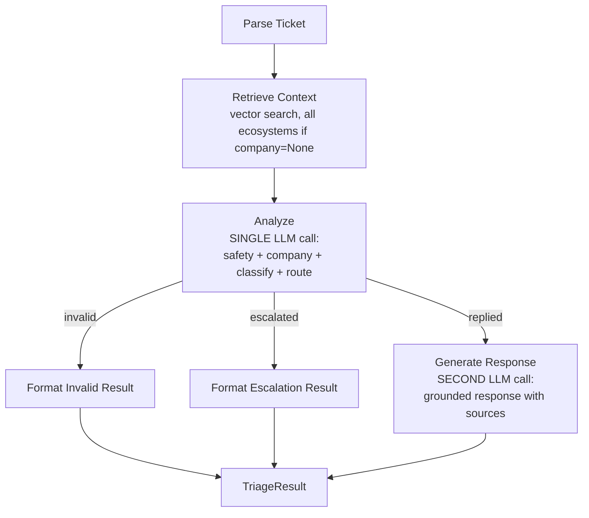

# Sprint 1 — Tech Leader & Architecture Review

> **Status: ALL FINDINGS ACCEPTED AND APPLIED.**
> T1-T8 accepted. Design docs updated. LangGraph removed, two-phase LLM adopted,
> Zod added, ESM configured, error recovery added, full corpus search, validate.ts planned.

## Finding T1: Effect.ts + LangGraph — Two Competing Runtime Models (Critical)

This is the biggest architectural risk. Effect.ts and LangGraph both want to own execution flow:

| Concern | Effect.ts | LangGraph |
|---------|-----------|-----------|
| Flow control | `Effect.gen` / `pipe` | `StateGraph` compiled graph |
| State management | `Context.Tag` + `Layer` | `Annotation` state object |
| Error handling | Typed error channel `Effect<A, E, R>` | Try/catch, untyped |
| Dependency injection | `Layer.provide` | Constructor injection / closures |
| Concurrency | `Effect.forEach` with concurrency option | Built-in streaming/parallel |

**The friction:** LangGraph's `StateGraph.compile().invoke()` returns a Promise and manages state internally. Effect.ts wants to manage the same concerns. If we use both, we get:
- Effect.ts managing the outer loop (CSV, layers, config)
- LangGraph managing the inner loop (per-ticket agent flow)
- Two state systems to bridge at the boundary
- LangGraph's errors are untyped — we lose Effect's typed error channel inside the graph

### Is LangGraph justified for our flow?

Our flow is **linear with one conditional branch**:

```
safety-gate -> infer-company -> retrieve -> classify -> route -> (respond | escalate)
```

LangGraph is designed for:
- Complex loops (agent re-planning)
- Tool use cycles
- Human-in-the-loop interrupts
- Multi-agent coordination

We have none of these. Our flow is a simple pipeline.

### Options

| Option | Architecture | Pros | Cons |
|--------|-------------|------|------|
| **A) Pure Effect.ts pipeline** | Each node = Effect function, compose with `Effect.gen` | Full type safety, one runtime model, simpler debugging, fewer deps | No LangGraph in the story, less "agent framework" cred |
| **B) LangGraph owns inner loop** | Effect outer (CSV, DI), LangGraph inner (per-ticket) | "Agent framework" story, visual graph | Two runtimes, state bridging, untyped errors inside graph |
| **C) LangGraph thin wrapper** | Use LangGraph for graph definition + visualization, but each node calls back into Effect | Best of both — graph structure visible, Effect handles execution | More boilerplate, complex bridging code |

### Recommendation: Option A (Pure Effect.ts pipeline)

**Rationale:**
- Our flow is linear. LangGraph adds complexity without benefit.
- Effect.ts already gives us composable, testable, typed pipelines.
- We still use LangChain for LLM calls and vector store — we're not losing the RAG story.
- For the AI Judge interview: "We evaluated LangGraph but chose pure Effect.ts because our flow is a linear pipeline with one conditional branch. LangGraph's value is in cyclic agent loops, which we don't need. We kept LangChain for LLM abstraction and RAG."
- **Saves ~0.5h** in P3 (no graph state bridging) and **removes 1 dependency**.

If the user insists on LangGraph, go with Option C.

---

## Finding T2: LLM Call Count — 3-4 Calls Per Ticket Is Expensive

Current 7-node design with LLM calls:

| Node | LLM call? | Notes |
|------|-----------|-------|
| Safety Gate | YES | Needs semantic understanding |
| Infer Company | MAYBE | Could be keyword-based for most cases |
| Retrieve | NO | Vector search only |
| Classify | YES | request_type + product_area |
| Route | MAYBE | Could be rule-based from classify output |
| Respond | YES | Only if replied |
| Escalate | NO | Template + justification from classify |

**Best case:** 3 LLM calls per ticket (safety, classify, respond)
**Worst case:** 4 LLM calls (+ infer company)

With 30 tickets: **90-120 Claude API calls**. At ~3s each = **4.5-6 min** runtime.

### Better idea: Two-Phase LLM Architecture



**Phase 1 — Analyze (1 LLM call):** Given the ticket + retrieved context, determine in one structured output call:
- `is_valid`: boolean (safety gate)
- `company`: inferred if None
- `request_type`: classification
- `product_area`: classification
- `status`: replied or escalated
- `escalation_reason`: if escalated

**Phase 2 — Respond (1 LLM call, only if replied):** Given ticket + context + classification, generate grounded response with source citations.

**Result:** 1-2 LLM calls per ticket instead of 3-4.
- 30 tickets x 2 calls = 60 calls max
- Runtime: ~3 min instead of ~6 min
- Cost: ~50% reduction

### Does combining hurt accuracy?

No — it **improves** accuracy because:
- Safety Gate without context might miss edge cases (e.g., French injection that mentions a real Visa issue)
- Route without classification context can't make informed decisions
- The LLM sees everything at once and makes a coherent decision

### Recommendation

Keep 7 domain concepts in the code (each as a pure function), but merge LLM calls:
- `analyzeTicket()` = one structured output call doing safety + classify + route
- `generateResponse()` = one call for grounded response (only if replied)
- Node functions for safety-gate, classify, route become **extractors** from the analyze result, not separate LLM calls

This preserves DDD separation in code while being efficient at runtime.

---

## Finding T3: Structured Output Is Critical — Not Mentioned in Plan

The LLM must return valid JSON matching our VO types. If it returns free-text, we need parsing logic that will break.

**LangChain solution:** `.withStructuredOutput(zodSchema)` on the ChatAnthropic model. This uses Claude's tool_use to guarantee JSON conforming to a Zod schema.

**Effect.ts solution:** `Schema.decodeUnknown` to validate at the boundary.

### Recommendation

Use both:
1. LangChain `.withStructuredOutput(zodSchema)` for the LLM call — guarantees valid JSON shape
2. Effect `Schema` to decode into typed VOs at the domain boundary

This should be in the tech design as a pattern.

---

## Finding T4: ESM vs CJS — LangChain Requires ESM

LangChain v0.3+ is ESM-only. This affects:
- `tsconfig.json` needs `"module": "NodeNext"` or `"module": "ESNext"`
- `package.json` needs `"type": "module"`
- Effect.ts supports ESM fine
- `tsx` handles ESM transparently

### Recommendation

Use ESM throughout. Set `"type": "module"` in package.json. Use `tsx` for dev and as the binary runtime. No compile step needed — tsx runs TypeScript directly.

The `hr` binary in package.json:
```json
{
  "bin": {
    "hr": "bin/hr.js"
  }
}
```

Where `bin/hr.js` is a thin wrapper:
```js
#!/usr/bin/env tsx
import './src/main.ts'
```

---

## Finding T5: Error Recovery Per Ticket

If the LLM call fails for ticket #15, the current plan processes sequentially and would crash the entire run. With 30 tickets taking ~3 min, losing progress is painful.

### Recommendation

Wrap each ticket processing in `Effect.either` or `Effect.catchAll`:
```typescript
Effect.forEach(tickets, (ticket) =>
  triageTicket(ticket).pipe(
    Effect.catchAll((error) => Effect.succeed(makeErrorResult(ticket, error)))
  ),
  { concurrency: 1 }
)
```

Failed tickets get a special TriageResult with `status: "escalated"` and justification explaining the error. This way the output CSV always has all rows.

---

## Finding T6: Retrieval Strategy — Company-Filtered vs Full Search

Current plan: "filtered by company". But this has issues:
- company=None tickets need full search
- A ticket labeled "HackerRank" might actually be about a Visa payment for HackerRank subscription
- Filtering too early reduces recall

### Better approach

Search full corpus always. 774 docs in memory is fast (~20ms). Company filtering is a premature optimization.

Include company as context in the Analyze prompt for the LLM to consider, but don't restrict vector search by company.

---

## Finding T7: No Validation / Smoke Test Strategy

The plan has P5 (Tune & Test) but no structured approach. With 10 sample tickets that have expected outputs, we should:

1. Run agent on `sample_support_tickets.csv`
2. Compare `status`, `request_type` as exact match
3. Compare `product_area` as exact match
4. Compare `response` qualitatively (manual review)
5. Score: X/10 correct on structured fields

### Recommendation

Add a simple `validate.ts` script that:
- Reads sample CSV (has expected outputs)
- Reads agent output
- Compares structured fields
- Prints accuracy per column

This makes P5 (tuning) data-driven instead of vibes-based.

---

## Finding T8: Build & Binary Strategy

The user wants `pnpm build` + binary `hr` command.

### Recommendation: tsx direct, no compile step

- `pnpm build` = `tsc --noEmit` (type check only)
- `hr` binary uses `#!/usr/bin/env tsx` shebang
- No compile step needed — tsx runs TypeScript directly
- `pnpm link --global` makes `hr` available system-wide

```json
{
  "scripts": {
    "build": "tsc --noEmit",
    "start": "tsx src/main.ts"
  },
  "bin": {
    "hr": "bin/hr.js"
  }
}
```

---

## Summary: Recommended Updates

| # | Update | Impact | Priority |
|---|--------|--------|----------|
| T1 | Drop LangGraph, use pure Effect.ts pipeline | Remove 1 dep, simpler architecture, save ~0.5h | HIGH |
| T2 | Two-phase LLM (Analyze + Respond) instead of 3-4 separate calls | 50% fewer API calls, faster, more accurate | HIGH |
| T3 | Add structured output pattern (Zod + withStructuredOutput) | Guarantees valid JSON from LLM | HIGH |
| T4 | ESM config with tsx, no build step | Faster iteration, simpler setup | MEDIUM |
| T5 | Error recovery per ticket with Effect.either | No full-run crashes on single ticket failure | MEDIUM |
| T6 | Search full corpus (no company filter), use company as context | Better recall, simpler retrieval logic | LOW |
| T7 | Add validate.ts for sample comparison | Data-driven tuning in P5 | MEDIUM |
| T8 | tsx direct binary, no compile step | Faster iteration | LOW |

### Advantages of updated approach
- Single runtime model (Effect.ts owns everything)
- Half the LLM calls (faster, cheaper)
- Type safety from LLM boundary to CSV output
- Error resilience per ticket
- Simpler dependency tree (6 deps instead of 7)

### Disadvantages / Trade-offs
- No "agent framework" in the stack (mitigated: LangChain RAG is still there, and "we evaluated LangGraph" is a strong interview answer)
- Two-phase LLM puts more load on one prompt (mitigated: Claude handles complex structured output well)
- No build step means tsx must be available (mitigated: it's a dev dependency)
